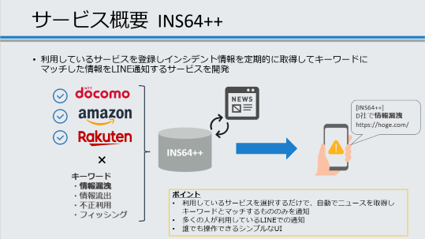

# INS64++ セキュリティインシデント通知サービス
## このサービスは何？
- 誰もが簡単にセキュリティインシデント情報を収集するためのツールです。
- ユーザが普段利用しているサービス（Amazon,楽天など）をINS64++に登録すると、利用サービスで発生したインシデント情報を定期的に取得してLINEに通知します。    
  

## サービスの利用方法
### ローカルでの立ち上げ
- LINE Notify APIの利用準備
  - (オプション作業)通知先となるLINEグループを事前に作成します。後から通知先グループを指定することも可能です。
  - [LINE Nortify公式サイト](https://notify-bot.line.me/ja/)よりアクセストークンを発行してください。

- ソースコードを取得します。  
  ```
  git clone https://github.com/horiid/mwscup2023.git
  ```
- `.env_sample` をコピーして、同階層に `.env` を作成してください。
- `.env`に先ほど発行したアクセストークンを記載してください。
    ```
    API_KEY="Your LINE Notify API Key"
    ```

## dockerコンテナの立ち上げ  
### 前提条件
- dockerがインストールされている環境であること

### コマンド
以下のコマンドを実行してください。
```sh
# ソースコードを取得します  
git clone https://github.com/horiid/mwscup2023.git

# dockerイメージをビルドします  
sudo docker build --tag ins64pp .

# 8000番ポートで起動します。  
sudo docker run -d -p 8000:5000 ins64pp
```

## 情報源について
- データ収集サイト（情報源）
  - ScanNetSecurity(https://scan.netsecurity.ne.jp/)
- 情報源として選定した理由
  - 1998年創刊の日本初のサイバーセキュリティ専門誌を母体とする専門サイトであり情報の信憑性が高い為。
  - セキュリティニュースが「インシデント」や「情報漏えい」等のカテゴリに体系立てられており閲覧性が高い為。
  - 独自記事が豊富である為。
    